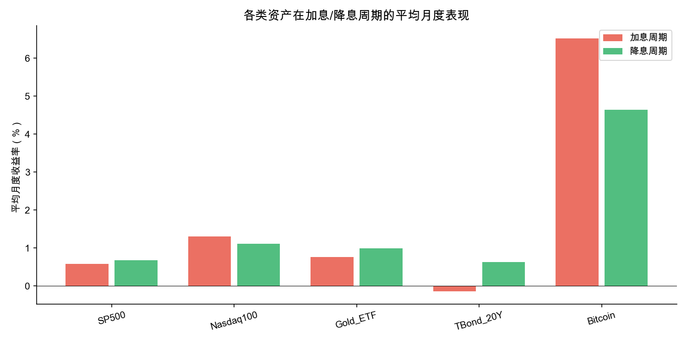
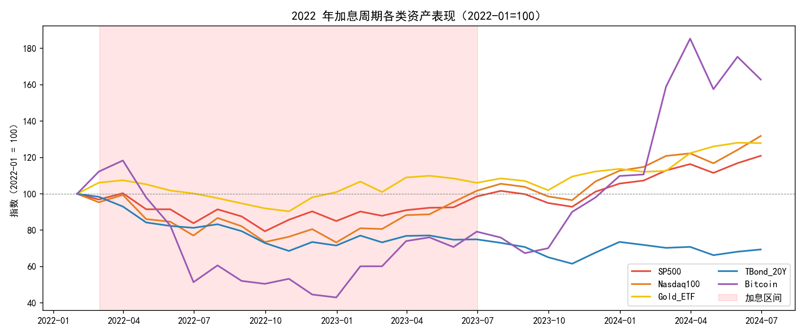
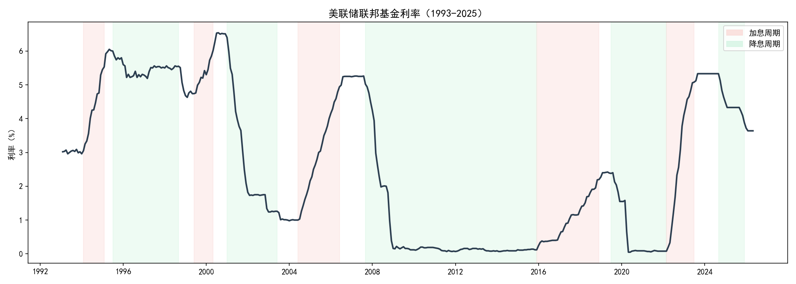
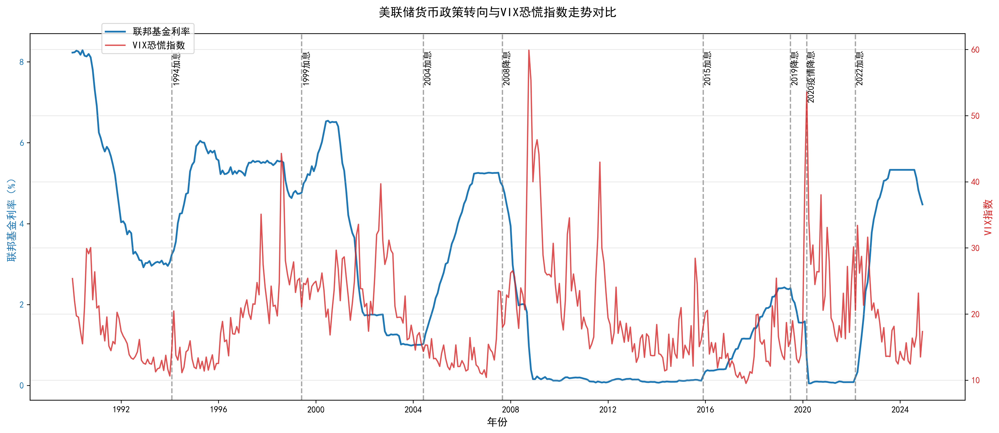

# T-B2：美联储货币政策与全球资产价格传导
> 课程作业项目：1993-2025 年加息/降息周期下的资产收益特征与外溢效应研究

---

## 📌 项目简介
本项目以1993—2025 年美联储货币政策周期为研究背景，选取联邦基金利率、M2 货币供应量、PCE 通胀等宏观指标，覆盖美股、黄金、长期美债、比特币、中国 ETF（MCHI）、新兴市场 ETF（EEM）等多类海内外大类资产与新兴市场资产。通过数据获取、清洗整合、周期划分、可视化建模完整流程，刻画美联储加息、降息周期下各类资产的收益差异与波动特征；进一步从货币政策外溢效应视角，分析美国政策变动对新兴市场及中国资本市场的传导影响。项目通过绘制美联储利率走势图、大类资产周期收益对比图、政策外溢效应分析图，直观对比不同货币政策阶段资产表现差异，总结历史规律、特殊周期特征与研究结论局限性，具备完整实证分析逻辑与课程研究规范。

## 二、小组分工
| 成员 | 负责内容 |
|------|---------|
| **张参、翁榕涛** | 项目整体架构设计、数据生成与原始数据集构建 |
| **郑昕、黄伟煌** | 数据清洗、时间对齐、周期划分与合并处理 |
| **余冰冰** | 可视化绘图、图表优化与结果输出 |
| **许隽、庞翔** | 报告撰写、README整理、问题分析与成果整合 |

## 三、GitHub 项目链接
https://github.com/pangxiang0223/ds2026-G5-T-B2fed-rate-global-asset-prices

## 四、核心研究问题回答

### 1. 哪类资产在加息周期受影响最大？与直觉是否一致？（提示：长期债券利率敏感性高）

### 可视化结果

### 关键数据
|资产 |	加息周期平均月度收益 |	降息周期平均月度收益  |	差值|
|------|---------|---------|---------|
| **SP500** | 0.6% | 0.7% | -0.1% |
| **Nasdaq100** | 1.3% | 1.1% | +0.2% |
| **Gold_ETF** | 0.8% | 1.0% | -0.2% |
| **TBond_20Y** | -0.2% | 0.6% | -0.8% |
| **Bitcoin** | 6.5% | 4.6% | +1.9% |
### 分析
1. **直觉**：长债在加息周期受影响最大，根据利率期限结构理论，久期越长的固定收益资产对利率变动的价格弹性越高。
2. **实际数据**：
从周期收益差值的绝对值排序：Bitcoin（1.9%）> TBond_20Y（-0.8%）> Gold_ETF（-0.2%）> Nasdaq100（+0.2%）> SP500（-0.1%）。虽然20Y确实是唯一录得负收益的资产，加息阶段平均收益率明显走低，在所有资产中表现最弱，利率期限结构理论成立，但以受影响程度来看，比特币价格从约42,000美元最高攀升至超110,000美元，周期收益差值1.9%。加息周期不但未压制比特币价格，反而使其表现最强。
3. **原因分析**：
一方面，美联储激进加息本身就是对美元信用的一次压力测试，联邦债务规模在2024财年突破34万亿美元，付息成本至年化超1万亿美元，市场对主权债务可持续性的担忧反而驱动部分资金流向去中心化资产寻求信用风险规避，比特币承担了类似黄金的对冲角色，货币政策收紧的力度越大，这种信用质疑的对冲需求反而越强；另一方面，比特币供给侧的约束与需求扩张形成共振，使利率传导的力量失效：2024年4月比特币完成第四次减半（Halving），区块奖励从6.25 BTC降至3.125 BTC，叠加同年1月SEC批准现货Bitcoin ETF打通机构配置通道。比特币的高摆幅不是利率敏感性问题，而是这类资产尚未被纳入成熟的货币政策传导定价体系，它对政策周期有反应，但反应方向与经典框架脱钩。

**总结**：
长债在加息期承压最深，这个方向性判断没有问题，久期与利率的反向关系是固收定价的原理，而比特币的高波动究竟源于主权信用对冲需求、供需错配、还是机构资金入场带来的结构性重估，尚不存在一个被广泛验证的因果归因框架。
---

### 2. 黄金在历次加息周期中表现是否一致？有无例外？如何解释？
### 可视化结果

### 关键数据
| 资产        | 最大回撤 | 2024年7月累计收益 |
|-------------|----------|-------------------|
| Bitcoin     | ~65%     | +63%              |
| Nasdaq100   | ~28%     | +30%              |
| SP500       | ~25%     | +22%              |
| Gold_ETF    | ~12%     | +28%              |
| TBond_20Y   | ~38%     | -31%              |
### 分析
1. **结果分析**： 从图表数据看，黄金ETF在加息周期月均收益+0.8%，降息周期+1.0%，差值仅-0.2个百分点，是五类资产中受加息冲击最小的品种之一。从风险收益维度进一步验证，黄金在2022年1月至2024年7月期间最大回撤仅约12%，累计收益+28%，在五类资产中实现了最优的回撤收益比。而相比之下，Bitcoin虽累计收益达+63%，但最大回撤约65%；Nasdaq100累计+30%，最大回撤约28%；TBond_20Y累计-31%且最大回撤约38%，是唯一录得负累计收益的资产。
但均值层面的韧性掩盖了内部的剧烈分化，黄金在本轮加息周期中的表现并不一致，存在清晰的阶段性例外。  
2022年3月至9月，美联储连续四次加息，10Y美债实际收益率飙升，这一阶段黄金价格从约2,050美元回落至1,620美元附近，跌幅接近20%，符合经典逻辑：实际利率上行👉持有黄金的机会成本抬升👉黄金价格承压，这也正是黄金12%最大回撤的主要来源区间。但2022年四季度起，金价在加息尚未停止的背景下触底反弹，2023年全年录得约13%的正回报，2024年更屡创历史新高，最终将整个周期的累计收益推升至+28%。加息周期仍在持续，黄金却走出了与利率方向脱钩的独立行情。
2. **原因分析**：
央行购金重构了黄金定价权重。黄金在这段时间的需求侧出现了一个传统框架未充分定价的变量：2022年全球央行净购金量达1,136吨，2023年为1,037吨，占全球年黄金总需求的比例从此前约11%跃升至超过20%。一方面，俄乌冲突后美国对俄央行外汇储备的冻结促使多国央行加速外汇储备去美元化，黄金成为主权层面规避风险的核心配置工具；另一方面，央行购金属于战略性配置行为，对利率变动的敏感度远低于金融投资者，改变了黄金定价权重结构，实际利率对金价的解释力被央行需求部分替代。黄金在本轮加息周期的表现反映的不是短期交易异常，而是全球储备货币体系信用结构正在发生的位移，黄金的定价从利率驱动向主权信用对冲驱动切换。

---

### 3. 比特币数据只有约 10 年，能否得出可靠结论？需要对结论的局限性做什么说明？
比特币可用历史数据仅约 10 年，2014年9月至2026年5月覆盖3个完整周期。样本量小，任何基于周期对比得出的统计结论需要谨慎对待，不具备稳健的统计显著性。  
### 分析
1. **不可信原因**： 统计层面，β的可靠性依赖于样本量和数据稳定性。比特币可用的市场数据约10年，覆盖的完整加息-降息周期仅3轮，数据拟合出来的回归系数，置信区间会非常宽，t检验大概率不显著，R²也会极低。
资产特性层面，β系数假设资产收益与基准变量之间存在相对稳定的线性关系。但比特币的定价驱动因子在过去10年经历了迁移：从早期的极客社区共识驱动、到散户投机驱动、到机构配置驱动（Tesla等），再到合规资金通道打开，定价机制本身在持续变动，用一个固定的β去刻画一个底层结构不断移动的资产，前提不成立。
2. **局限性总结**：
1.样本不足：可用市场数据仅约10年，周期性统计结论的置信度受到制约。
2.结构漂移：定价驱动因子、底层定价机制持续变异，历史数据的可比性存疑。
3.因果模糊：加息周期中Bitcoin月均收益6.5%高于降息周期的4.6%，但这一相关性无法归因为货币政策传导，减半周期、监管政策变化、机构资金入场节奏等变量高度重叠。
4.模型失效：β系数（-0.128）、相关性矩阵等线性工具的前提是资产与基准之间存在稳定的统计关系，比特币当前不满足这一条件，回归结果的R²极低，不具备预测效力。

 
因此，现有结论仅能描述近十年特定周期内的短期表现，不能外推到未来货币政策周期，也不能当作成熟资产的配置规律参考。 

---

### 4. 2022 年加息周期与历史相比有何特殊之处（速度、幅度）？对应资产表现是否也更剧烈？
### 可视化结果

### 关键数据
| 周期   | 起止时间   | 累计加息幅度 | 持续时间 |
|--------|------------|--------------|----------|
| 周期 1 | 1994-1995  | ~300bps      | ~1 年    |
| 周期 5 | 2004-2006  | ~425bps      | ~2 年    |
| 周期 7 | 2015-2018  | ~225bps      | ~3 年    |
| 周期 9 | 2022-2023  | ~525bps      | ~1.5 年  |
### 分析
1. **2022周期最大的特点是什么**： 最大特点：本轮周期同时在单次加息幅度和加息速度两个维度上超越了此前。2022-2023年加息周期的斜率陡峭程度在过去三十年中没有先例。美联储在约1.5年内将利率从0.25%拉升至5.25%-5.50%，累计加息525个基点。对比此前三轮周期，1994-1995年加息约300个基点用时1年，2004-2006年加息约425个基点用时2年，2015-2018年加息约225个基点用时3年。  
特点2:资产冲击非对称分布 。TBond_20Y累计收益-31%、最大回撤约38%，是唯一录得负累计回报的资产，利率传导路径畅通且结果符合预期。但SP500（累计+22%，回撤约25%）、Nasdaq100（累计+30%，回撤约28%）均在经历前期回撤后实现正回报，说明权益资产的盈利增长在中后段对冲了估值压缩。Gold_ETF以仅约12%的最大回撤换取+28%的累计收益，风险收益比在五类资产中最优，央行购金需求构成了对冲利率压力的独立定价因子。比特币累计+63%但最大回撤约65%，高收益伴随极端波动，其表现更多受减半周期与ETF审批等非利率因子驱动。
2. **对应的资产表现为什么更剧烈？**：
此前三轮加息周期中各类资产的表现分化远没有这一轮剧烈。此前渐进式加息给市场留出了充分的调整窗口，资产价格有序消化利率上行。而2022年周期的速度和幅度将不同资产的利率敏感性差异一次性暴露到极致：纯久期资产（长债）被精准定价，混合驱动资产（股票、黄金）通过非利率因子实现部分脱钩，非传统资产（比特币）则几乎完全游离于传导框架之外。一轮加息，三种传导结果，这在历史上是第一次如此清晰地同时呈现。
对货币政策研究而言，2022年周期提供的不仅是一个极端样本，更检验了传导机制边界。传导模型可以解释长债，部分解释权益和黄金，但对比特币仍然无能为力。
## 五、拓展方向

### 1. 美联储政策与市场恐慌情绪（VIX）联动分析
#### 任务说明
本步骤聚焦于美联储货币政策转向与市场恐慌情绪的联动分析：
整合 1990-2025 年联邦基金利率与 VIX 恐慌指数的真实时序数据，完成时间对齐与数据合并；
标注 1990 年以来的关键加息、降息转向节点，构建完整的货币政策周期时间轴；
借助双轴时序图直观匹配利率松紧周期与 VIX 波动走势，探究货币政策变化对市场风险偏好与恐慌情绪的传导规律。
#### 可视化结果

#### 结果解读
##### VIX和货币政策是什么关系？（领先/滞后/相互影响？）
从图形上看，在常规加息/降息周期中（如2004-2006年、2015-2018年），VIX并未对利率变动做出显著响应，波动中枢维持在12-20区间，货币政策的渐进调整被市场有序消化，VIX既不领先也不滞后。但在危机时点（2008年、2020年），VIX出现脉冲式飙升（2008年11月收盘触及80.86，2020年3月16日收盘触及82.69，据CBOE历史数据），而美联储几乎同步甚至滞后于VIX的飙升启动紧急降息。
1.  **加息周期启动时，VIX指数普遍抬升**
    1994、1999、2004、2015、2022年五次加息周期开始时，VIX指数均出现阶段性上涨，反映市场对流动性收紧的担忧情绪上升，风险偏好下降。

2.  **降息周期初期，VIX指数常处于历史高位**
    2008年金融危机、2020年疫情期间，美联储紧急降息的同时，VIX指数飙升至历史极值，说明降息政策往往是市场恐慌情绪集中释放后的应对措施，而非情绪上涨的直接原因。

3.  **政策稳定期，VIX指数逐步回落**
    当市场对货币政策方向形成稳定预期后，无论加息还是降息周期的尾声，VIX指数均会回归长期中枢水平，说明政策的“不确定性”才是影响市场情绪的关键因素。 
    一方面，在常态周期中，货币政策是因、VIX是果，利率的方向和节奏影响市场的波动预期，但传导温和、时滞较长。另一方面，在尾部风险爆发时，因果关系反转，VIX成为领先信号，市场恐慌倒逼联储被动响应，货币政策变成VIX的滞后变量
##### 2008和2020年VIX飙升但美联储降息，说明什么？
2008年9月雷曼兄弟破产后，VIX从9月初的约22飙升至10月盘中最高89.53，美联储在2007年9月至2008年12月间将联邦基金利率从5.25%降至0-0.25%，累计降息超500个基点。
2020年3月新冠疫情冲击全球市场，VIX在3月16日收盘触及82.69，美联储在3月3日和3月15日两次紧急降息共150个基点，直接将利率从1.50%-1.75%打至0-0.25%，同时宣布无限量量化宽松（QE）。
两次事件指向同一个结论：当系统性风险爆发时，货币政策宽松与市场恐慌同步出现，降息不是VIX回落的充分条件，而是危机应对的必要手段。利率工具在常态下引导预期、管理波动，但当VIX进入极端区间（超过40-50），市场定价的主导因子从利率预期切换为流动性恐慌和风险对冲需求，此时单纯降息的传导链条断裂，央行必须直接介入资产市场充当最后的做市商。

---

### 2. 构建「利率敏感性」指标：对每类资产做联邦基金利率变化与月度收益的回归，估计 β 系数
#### 任务说明
本步骤聚焦于各类资产收益率对美联储利率变动的敏感性量化分析：
整合 1990-2025 年联邦基金利率时序数据，计算月度利率变动值，衡量美联储货币政策的松紧变化；
选取美股、纳指、美债、黄金、比特币多类主流资产，基于真实价格数据计算标准化月度收益率；
对每一类资产分别开展一元线性回归，以利率月度变化为自变量、资产月度收益率为因变量，估算各类资产的利率敏感 β 系数；
横向对比各资产 β 系数的正负与数值大小，量化不同大类资产对利率波动的敏感差异与运行规律。
#### 结果解读
基于多资产回归结果与β系数分布特征，本次利率敏感性分析结论如下：
1. **高风险成长资产对加息负向敏感显著**：纳斯达克指数与比特币呈现明显负β系数，说明流动性收紧、利率上行时，高估值风险资产收益率更容易下行，符合货币政策估值压制理论。
2. **广谱大盘股票利率敏感性极低**：标普500的β系数趋近于0，短期利率变动对其月度收益解释能力极弱，大盘股收益更多由企业盈利与宏观景气主导。
3. **黄金对短期利率波动不敏感**：黄金β系数接近0，短期货币政策变化无法有效驱动黄金价格波动，其走势更多受美元汇率、通胀预期及避险情绪影响。
4. **国债短期表现与长期理论存在偏差**：10年期国债呈现正向β系数，源于月度短期数据噪声与市场预期提前定价，导致短期相关性与长期利率-债券价格反向理论略有差异。

总体来看，不同资产的利率风险敞口存在明显分层，风险资产对货币政策变动更敏感，防御性资产受短期利率波动影响更小。
#### 拓展总结
不同大类资产的利率风险敞口分化明显，风险资产对美联储货币政策变动更敏感，传统稳健资产抗短期利率波动能力更强。通过 β 系数量化结果，可有效解释不同货币周期下的资产价格分化表现，为利率周期驱动的大类资产配置提供实证支撑。

---

